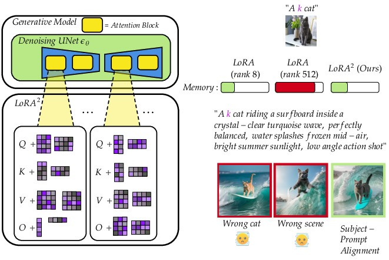

<div align="center">

# Not All Layers Are Created Equal: Adaptive LoRA Ranks for Personalized Image Generation

[Donald Shenaj](https://donaldssh.github.io/)</a><sup>1</sup>&nbsp;
[Federico Errica](https://diningphil.github.io/)<sup>2</sup>&nbsp;
[Antonio Carta](https://pages.di.unipi.it/carta/)<sup>1</sup>&nbsp;


<sup>1</sup> University of Pisa &nbsp; <sup>2</sup> NEC Laboratories Europe &nbsp;


[](https://donaldssh.github.io/NotAllLayersAreCreatedEqual)
[](https://arxiv.org/abs/2603.21884)
[](#Citation)




</div>

Code coming soon!


## Abstract
Low Rank Adaptation (LoRA) is the de facto fine-tuning strategy to generate personalized images from pre-trained diffusion models. Choosing a good rank is extremely critical, since it trades off performance and memory consumption, but today the decision is often left to the community's consensus, regardless of the personalized subject's complexity. The reason is evident: the cost of selecting a good rank for each LoRA component is combinatorial, so we opt for practical shortcuts such as fixing the same rank for all components.
In this paper, we take a first step to overcome this challenge. Inspired by variational methods that learn an adaptive width of neural networks, we let the ranks of each layer freely adapt during fine-tuning on a subject. We achieve it by imposing an ordering of importance on the rank's positions, effectively encouraging the creation of higher ranks when strictly needed. Qualitatively and quantitatively, our approach, LoRA<sup>2</sup>, achieves a competitive trade-off between DINO, CLIP-I, and CLIP-T across 29 subjects while requiring much less memory and lower rank than high rank LoRA versions.


## Citation

```
@article{shenaj2026not,
  title={Not All Layers Are Created Equal: Adaptive LoRA Ranks for Personalized Image Generation},
  author={Shenaj, Donald and Errica, Federico and Carta, Antonio},
  journal={arXiv preprint arXiv:2603.21884},
  year={2026}
}
```
